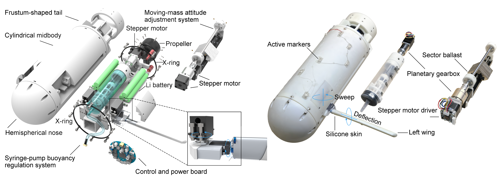
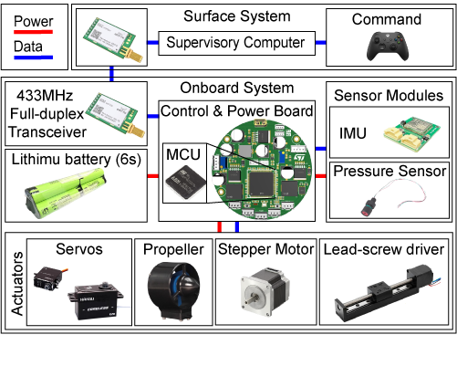

<p align="center">
  
</p>
<p align="center">
  
</p>

# Morphing-Wing MUG Open-Source Repository

This repository is the public release hub for the morphing-wing MUG platform. It is intended to collect the experimental dataset, hardware design files, electronics documentation and upper/lower computer software associated with the paper.


## Repository Layout

```text
Morphing_wing_MUG/
├── assets/                  # overview images, animations, README media
├── data/
│   └── raw_mocap_csv/        # selected raw motion-capture CSV files
├── electronics/              # electrical architecture, PCB
├── hardware/                 # CAD
└── software/                 # host software, firmware
```

## Dataset Subset

The current dataset release contains raw motion-capture CSV files, which are stored under `data/raw_mocap_csv/`.
