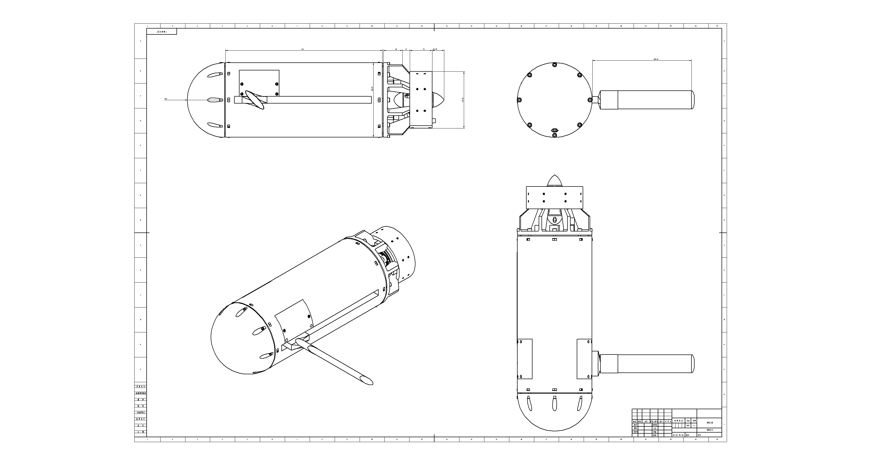
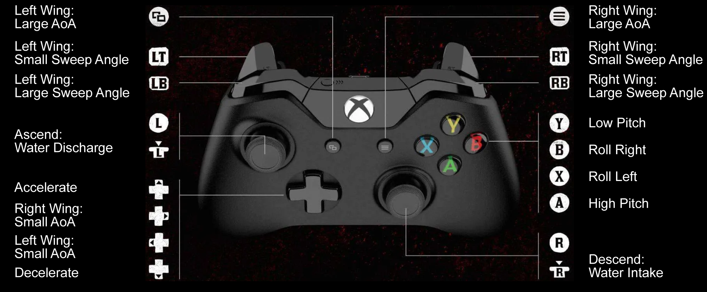

# Morphing-Wing MUG Open-Source Repository

This repository is the public release hub for the morphing-wing MUG prototype. It collects the experimental motion-capture dataset, the hardware design files, electronics documentation, and upper/lower computer software associated with the paper.

<p align="center">
  
</p>

<p align="center">
  <sub>Hardware overview of the morphing-wing MUG prototype.</sub>
</p>

## System Overview

<table>
  <tr>
    <td width="70%" align="center">
      
      <br>
      <sub>Electrical architecture and onboard system connections.</sub>
    </td>
    <td width="30%" align="center">
      
      <br>
      <sub>PCB view of the embedded electronic system.</sub>
    </td>
  </tr>
</table>

<table>
  <tr>
    <td width="50%" align="center">
      
      <br>
      <sub>Three-view drawing of the prototype, with the left wing fully deployed and the right wing fully folded.</sub>
    </td>
    <td width="50%" align="center">
      
      <br>
      <sub>Functional experiment validation of open-loop gate traversal and asymmetric-wing turning experiments.</sub>
    </td>
  </tr>
</table>

<p align="center">
  
  <br>
  <sub>Joystick button-function mapping for operating the morphing-wing MUG prototype.</sub>
</p>

## Repository Layout

```text
Morphing_wing_MUG/
|-- assets/                  # overview images and README media
|-- data/
|   `-- raw_mocap_csv/       # raw motion-capture CSV files
|-- electronics/             # electrical architecture and PCB files
|-- hardware/                # CAD and hardware documentation
`-- software/                # host software and embedded firmware
```

## Dataset Subset

The current dataset release contains raw motion-capture CSV files under:

```text
data/raw_mocap_csv/
```
